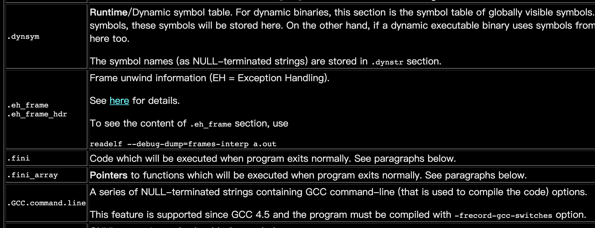

[TOC]

如果想修改POSIX API的行为，通常我们的第一想法是修改libc库函数，并维护一份自定义的libc。这样做的代价非常大，因为libc是基础库，接口非常多，涉及的面也很广。修改可能不难，但后期维护，merge主干的工作比较麻烦，也没有价值。修改libc函数实现，还有一个缺点是，编译时修改，而非运行时。这会给一些无法下线并重新打包的程序带来困扰，例如程序已经分发，重新打包再分发耗时耗力。如果能找到运行时修改的方法，例如，暂停服务，替换一个库文件就可以修改某些行为。如果能做到运行时修改，对于调试也是非常友好的。
幸运的是，在Linux上，修改libc的方法很多：
1. 使用LD_PRELOAD，覆盖libc中的函数
2. 使用alias替代weak_alias，编译替换libc函数
3. 使用GOT表覆盖libc函数实现

1和3都是动态，运行时修改。3更棒的是，可以做运行时动态获得libc的原实现函数指针，并用自定义实例去覆写。这样在内部可以保存两份实例，而无需维护开源实例。
在整个的学习和实验中查阅了不少资料，回头看来，其中比较有价值的应当是文末的参考文献中列出的一些链接。
[Android so注入(inject)和Hook技术学习（二）——Got表hook之导入表hook](https://www.cnblogs.com/goodhacker/p/9306997.html)
我的实验代码基于这个网页中的方法二实例代码，通过解析.dynamic section来获取GOT地址，并覆盖对应表项
[Executable and Linkable Format](https://stevens.netmeister.org/631/elf.html)
这个帖子非常棒，详细阐述了动态链接的过程，包括link editor以及runtime dynamic link流程。只是可能时间比较久，其中的一些链接都失效了
[Oracle Documentation](https://docs.oracle.com/cd/E19683-01/817-3677/6mj8mbtc9/index.html#chapter6-79797)
[Executable and Linking Format Specification, Version 1.2](https://refspecs.linuxbase.org/elf/elf.pdf)
这两个链接都给出了一些较为官方的阐述，针对各个section，以及对应的取值等等，作为手册查询很好。

## ELF概述
>**from Wiki**
>Executable and Linkable Format (ELF, formerly named Extensible Linking Format), is a common standard file format for executable files, object code, shared libraries, and core dumps. 

```
              +-----------------+
         +----| ELF File Header |----+
         |    +-----------------+    |
         v                           v
 +-----------------+      +-----------------+
 | Program Headers |      | Section Headers |
 +-----------------+      +-----------------+
      ||                               ||
      ||                               ||
      ||                               ||
      ||   +------------------------+  ||
      +--> | Contents (Byte Stream) |<--+
           +------------------------+
```
ELF格式通常有linking view和execution view，即编译时，和运行时的不同。

linking view时，可以没有Program Header Table，但必须要有Section Header Table
反之，execution view时，必须有Program Header Table, 但可以没有Section Header Table
>我理解之所以要这么分成不同的view的原因是，运行时，内存比较宝贵，ELF文件被加载时，相关的节(section)被合并成segment。

segment列表[2]

程序运行时，就体现为这些段。而对于本文比较重要的段就是DYNAMIC段，其中包含了一组_DYNAMIC array。后文再做介绍。

section列表节选[2]

section就是我们常见的以点开头的一些标记。链接脚本（linker script, .lds文件），也正是定义的这些ELF文件中的节。常见的节有: .bss, .data, .text, .init等等。

## 动态链接
我们知道当引用第三方库的时候，通常有两种链接方式，一种是动态链接，一种是静态链接。静态链接库在Windows上是.lib结尾的，在Linux平台上是.a结尾的。静态库不是一种可执行文件，而只是一些代码和数据打包（Archive）。当发生链接时，由链接器将其中的代码和数据分别放到最终的ELF文件的对应的节（section）。
而动态库是一种完全不一样的东西，动态库的行为更趋近于可执行文件。在Windows平台上，动态库文件以.dll结尾，在Linux平台上，动态库文件以.so结尾。
在Windows下，如果要进行动态链接，必须使用LoadLibrary函数打开一个.dll库文件，再用GetProcAddress获取具体函数的地址，进行调用。dll导出函数列表可以使用命令查看：`dumpbin /exports <dll文件完整路径>`。
Linux下也有类似的方式，就是可以用dlopen打开一个.so文件，再用dlsym找到对应的函数。但是Linux通常使用动态链接库的方式，是直接链接。例如：
`gcc -L/lib -ltest main.c -o test`
这就是在lib搜索路径下，找到libtest.so，并链接。注意这里默认先尝试动态链接，如果没有.so文件，会再尝试静态链接.a文件。如果都没有，就会报错。这也就是说Linux平台上，通过-l参数指定的链接参数，是默认尝试动态链接，其次才是静态链接。
如果想指定使用静态链接，可以用下面的命令：
`gcc -L/lib -static -ltest main.c -o test`
或者
`gcc -L/lib libtest.a main.c -o test`

### How is an executable binary in Linux being executed ?[2]
1. `sys_execve` function (in arch/x86/kernel/process.c) handles the execvc system call from user space. It calls `do_execve` function. 
2. `do_execve` function (in fs/exec.c) opens the executable binary file and does some preparation. It calls `search_binary_handler` function. 
3. `search_binary_handler` function (in fs/exec.c) finds out the type of executable binary and calls the corresponding handler, which in our case, is `load_elf_binary` function.
4. `load_elf_binary` (in fs/binfmt_elf.c) loads the user's executable binary file into memory. It allocates memory segments and zeros out the BSS section by calling the padzero function.
`load_elf_binary` also examines whether the user's executable binary contains an INTERP segment or not.
5. If the executable binary is dynamically linked, then the compiler will usually creates an **INTERP** segment (which is usually the same as .interp section in ELF's "linking view"), which contains the full pathname of an "interpreter", usually is the Glibc runtime linker ld.so.
To see this, use command `readelf -p .interp a.out`

6. Thus, if the ELF executable binary file contains an **INTERP** segment, `load_elf_binary` will call load_elf_interp function to load the image of this interpreter as well.
7. Finally, `load_elf_binary` calls start_thread (in arch/x86/kernel/process_64.c) and passes control to either the interpreter or the user program.

这个1-7就是ELF文件被加载的过程，之后，再只要一个跳转语句，就可以真正的执行这个程序了。这里值得关注的就是第5步。如果被加载的二进制是动态链接生成的，即要么是动态链接库，要么是可执行文件，则加载时，内核会给ELF的内存镜像（即所谓的executing view）加一个INTERP段（segment）。而这个段就是所谓的runtime linker（compile时的linker，即ld，称为link editor），也就是ld.so。

### ld.so
什么是ld.so? ld.so做了些啥？文献[2]都做了很好的说明。
> ld.so is the runtime linker/loader (the compile-time linker ld is formally called "link editor") for dynamic executables. It provides the following services [2]:
> - Analyzes the user's executable binary's DYNAMIC segment and determines what dependencies are required. 
> - Locates and loads these **dependencies**, analyzes their DYNAMIC segments to determine if more dependencies are required.
> - Performs any necessary relocations to bind these objects.
> - Calls any initialization functions (see below) provided by these dependencies.
> - Passes control to user's executable binary.

### How does ld.so work ?[2]
ld.so是用来加载所有的动态库的，所以ld.so本身不是动态加载的。ld.so的入口在_dl_start。可以通过gdb停在这个函数上。
```
(gdb) break _dl_start
Function "_dl_start" not defined.
Make breakpoint pending on future shared library load? (y or [n]) y
Breakpoint 1 (_dl_start) pending.
(gdb) run
Starting program: a.out

Breakpoint 1, 0x0000003433e00fa0 in _dl_start () from /lib64/ld-linux-x86-64.so.2
(gdb) bt
#0  0x0000003433e00fa0 in _dl_start () from /lib64/ld-linux-x86-64.so.2
#1  0x0000003433e00a78 in _start () from /lib64/ld-linux-x86-64.so.2
#2  0x0000000000000001 in ?? ()
#3  0x00007fffffffe4f2 in ?? ()
#4  0x0000000000000000 in ?? ()
...
(gdb) x/10i $pc
   0x3433e00a70 <_start>:       mov    %rsp,%rdi
   0x3433e00a73 <_start+3>:     callq  0x3433e00fa0 <_dl_start>
   0x3433e00a78 <_dl_start_user>:       mov    %rax,%r12
   0x3433e00a7b <_dl_start_user+3>:     mov    0x21b30b(%rip),%eax        # 0x343401bd8c <_dl_skip_args>
...
```
当_dl_start执行完后，ld.so就会为我们分析依赖关系，并加载起所有必需的动态库文件。

上图就是ld.so加载完成后，程序的内存分布。其中可以发现每个so文件都占了4个表项。我一度以为这4个表项都是同样的东西。但如上图所示,这每一段实际是动态库被加载生成的段，每一段有不同的内容和不同的权限标记。而我们关心的和函数跳转相关的PLT&GOT数据在这里：
```
0000003434551000      4K rw---  /lib64/libc-2.5.so     <-- .got.plt .data sections
```
## PLT & GOT
PLT = Procedure Linkage Table
GOT = Global Offsets Table
PLT表搭配GOT表就可以完成动态库函数的重定向。
当编译时，在链接阶段，编译器会查找函数定义，如果在所有的可重定向代码中，即.o、.a文件，无法找到函数定义，则会去链接指定的动态库.so文件中找。这里有两层意思：
1. 会优先查找有函数定义的，也就是说静态库或源文件中定义的函数是可以覆盖动态库中函数的
2. 编译器会为动态库中函数生成跳转代码。而这个跳转代码就是PLT表

可以用`objdump -M intel -dj .plt a.out`命令查看PLT表具体反编译代码，例如：

一个PLT表项就是3条汇编语句,其流程就是下图中的1-9

- 第一条汇编语句，就是跳转到GOT对应表项，当该表项尚未被填充时（函数第一次被调用），GOT表项会重新跳回到PLT表项的下一条汇编
- 第二条汇编语句，将函数编号push到栈上，此时是准备一次函数调用
- 第三条汇编语句，跳转到PLT表开始的地方。PLT第一个表项指向的是_dl_runtime_resolve函数，该函数会找到之前传入的函数编号对应的函数地址，并填充对应的GOT表项。

关于函数编号，举个例子，解释一下：
```
#include <stdio.h>
#include <fcntl.h>
int func(void)
{
    open("foo.txt", O_CREAT);
    fopen("foo.txt", "rw");
    printf("hello, in test.so\n");
    return 0;
}
```
这里引用了glibc里的3个函数，用readelf -r查看，则会得到下面的结果：
```
重定位节 '.rela.plt' at offset 0x508 contains 3 entries:
  偏移量          信息           类型           符号值        符号名称 + 加数
000000201018  000200000007 R_X86_64_JUMP_SLO 0000000000000000 puts@GLIBC_2.2.5 + 0
000000201020  000400000007 R_X86_64_JUMP_SLO 0000000000000000 open@GLIBC_2.2.5 + 0
000000201028  000500000007 R_X86_64_JUMP_SLO 0000000000000000 fopen@GLIBC_2.2.5 + 0
```
则puts对应的编号就是0，open是1，fopen是2。看看PLT表：
```
000000000000580 <puts@plt>:
 580:	ff 25 92 0a 20 00    	jmp    QWORD PTR [rip+0x200a92]        # 201018 <puts@GLIBC_2.2.5>
 586:	68 00 00 00 00       	push   0x0
 58b:	e9 e0 ff ff ff       	jmp    570 <.plt>

0000000000000590 <open@plt>:
 590:	ff 25 8a 0a 20 00    	jmp    QWORD PTR [rip+0x200a8a]        # 201020 <open@GLIBC_2.2.5>
 596:	68 01 00 00 00       	push   0x1
 59b:	e9 d0 ff ff ff       	jmp    570 <.plt>

00000000000005a0 <fopen@plt>:
 5a0:	ff 25 82 0a 20 00    	jmp    QWORD PTR [rip+0x200a82]        # 201028 <fopen@GLIBC_2.2.5>
 5a6:	68 02 00 00 00       	push   0x2
 5ab:	e9 c0 ff ff ff       	jmp    570 <.plt>
```
理解了PLT和GOT表在解析函数地址中的作用，就可以着手修改GOT表，让函数跳转到我们希望的函数执行。
## 替换GOT表项
正如前文所说，要做这个替换的操作，就是要找到GOT表对应的表项在哪里，然后修改对应的函数地址即可。这涉及到解析内存中的程序elf格式的镜像。
### dynamic section
所有和重定向有关的信息都包含在dynamic section中，在elf的execution view中，也可以称作dynamic segment。实际上，这两者是同一个东西，只是存在的方式不同。当然，因为我们要做的是动态的GOT修改，所以我们要找到dynamic segment在内存中的位置。
由前文可知，要在execution view中查找段，应该要用到Programm Header Table（PHT）。通过`objdump -x`命令可以查看PHT表项。其中我们关心的就是DYNAMIC段。它包含了所有dynamic section的信息。代码里面，可以如下的获得dynamic。
``` c
// 1. 通过/proc/<pid>/maps得到elf加载的地址
    snprintf(filename, sizeof(filename), "/proc/%d/maps", pid);

    // 打开文件/proc/pid/maps，获取指定pid进程加载的内存模块信息
    fp = fopen(filename, "r");
    if(fp != NULL){
        // 每次一行，读取文件 /proc/pid/maps中内容
        while(fgets(line, sizeof(line), fp)){
            // 查找指定的so模块
            if(strstr(line, module_name)){
                // 分割字符串
                pch = strtok(line, "-");
                // 字符串转长整形
                addr = strtoul(pch, NULL, 16);
                break;
            }
        }
    }
    fclose(fp);
  
// 2. 通过遍历program header table，找到dynameic段
    unsigned long long dynamicAddr = 0;
    unsigned int dynamicSize = 0;
    int j = 0;
    for (j = 0; j < phdr_count; j++)
    {
        if (phdr_table[j].p_type == PT_DYNAMIC)
        {
            dynamicAddr = phdr_table[j].p_vaddr + (uint64_t)base_addr;
            dynamicSize = phdr_table[j].p_memsz;
            break;
        }
    }
```
### relocation tables
通过`objdump -h`命令可以查看文件包含的section。和relocation相关的节有：
- .got
- .got.plt
- .plt
- rel(a).dyn
- rel(a).plt
- 其他rel(a).xxx节
刚开始的时候，这些类似的节名很容易让人混淆。其实和我们目标真正相关的是rel(a).plt。其他的让我依次澄清一下。不过都是我个人的理解，可能有偏颇之处。
先用`readelf -S`查看一下section header table。

.plt和.plt.got以及.got和.got.plt都是PROGBITS类型。关于PROGBITS类型的解释是：
> **PROGBITS** is stored in the disk image, as opposed to allocated and initialized at load.
> 节区类型：PROGBITS-程序定义的信息，NOBITS-不占用文件空间(bss),REL-重定位表项

对于各节区，[2]中的解释为：
- .plt:	For dynamic binaries, this Procedure Linkage Table holds the trampoline/linkage code. See paragraphs below.
- .got:	For dynamic binaries, this Global Offset Table holds the addresses of variables which are relocated upon loading.
- .got.plt:	For dynamic binaries, this Global Offset Table holds the addresses of functions in dynamic libraries. They are used by trampoline code in .plt section.

对于.plt.got区网上搜到的解释是：
- This just seems to contain code to jump to the first entry of the .got.

这里很容易让人有很混乱的感觉，又是.got.plt的, 又是.plt.got的。网络上也很难查到两者之间的联系和区别。根据我个人的实验经验，后文尝试解释一下。先对这几个节区做一个总结。
- 这4个都是编译时决定的，节类型都是PROGBITS。信息都是存在可执行文件里，而runtime可用的信息都是通过重定向得到的，即通过rel(a).xxx节区获得的内存地址中存储的数据
- 所有以.plt开头的节区，都是一些跳板代码。
- 所有以.got开头的节区，都是一些数据，存储着这些函数被resolve后最终的地址。
- .plt开头表项的跳板代码，就是跳转到对应的.got表项中决定最终的执行地址。
```x86asm
# table of a dynamic library (.so)
  [10] .plt              PROGBITS         0000000000000610  00000610
  [11] .plt.got          PROGBITS         0000000000000640  00000640
  [20] .got              PROGBITS         0000000000200fc0  00000fc0
  [21] .got.plt          PROGBITS         0000000000201000  00001000
```

#### .plt vs .plt.got
先上2个例子，分别是.plt和.plt.got节的。可以看出，这2个节都是一些跳转代码。按照前文的解释，.plt节表项就是需要动态链接的一些函数的跳板代码。跳转代码的目的地是GOT表项。然后通过runtime linker（ld.so)来完成函数地址的解析。
.plt.got的内容与.plt非常类似，也是一些跳板代码。而且jmpq指令后，没有push指令和另一条jmpq指令。这个节和.plt节到底有啥区别？啥时候会用到该节的跳转指令？
```armasm
# .plt节举例
00000000000008c0 <fopen@plt>:
 8c0:	ff 25 ea 16 20 00    	jmpq   *0x2016ea(%rip)        # 201fb0 <fopen@GLIBC_2.2.5>
 8c6:	68 09 00 00 00       	pushq  $0x9
 8cb:	e9 50 ff ff ff       	jmpq   820 <.plt>


# .plt.got节举例
00000000000005d0 <fopen@plt>:
 5d0:	ff 25 12 0a 20 00    	jmpq   *0x200a12(%rip)        # 200fe8 <fopen@GLIBC_2.2.5>
 5d6:	66 90                	xchg   %ax,%ax
```
经过我的实验发现，当发生类似这种函数指针赋值时，动态链接函数就会出现在.plt.got节，同时.plt节中就不再包含这个函数。
```c
FuncPuts old_puts = NULL;
old_puts = puts; // puts as a function pointer, assigned to a variable
```
当函数不在.plt节时，函数的跳转变成静态的了。用`objdump -S`对照汇编和源码，可以发现，对此类函数的调用就是跳转到对应的.plt.got表项。
```x86asm
puts("hello");
 751:   48 8d 3d 8c 00 00 00    lea    0x8c(%rip),%rdi        # 7e4 <_fini+0x14>
 758:   e8 e3 fe ff ff          callq  640 <puts@plt>
 
 # 对应的.plt.got表项
 0000000000000640 <puts@plt>:
 640:   ff 25 82 09 20 00       jmpq   *0x200982(%rip)        # 200fc8 <puts@GLIBC_2.2.5>
 646:   66 90                   xchg   %ax,%ax 
```
> **注**: `xchg %ax, %ax`是一条NOP指令，参看[Why does Visual Studio use xchg ax,ax](https://stackoverflow.com/questions/2136043/why-does-visual-studio-use-xchg-ax-ax)

当只有.plt.got包含该函数表项时，我们的GOT替换魔法就失效了。所以如果想保存原函数指针，正确的做法应当是：
```c
// Don't do like this.
// It will kick puts from .plt and put it into .plt.got.
// We might not be able to substitute its address via rel tables.
// old_puts = puts; 

// Below is RECOMMENDED!!!
if (old_puts == NULL) { // save original libc function pointer
    old_puts = (FuncPuts)*(uint64_t *)(rel_table[i].r_offset + base_addr);
}
*(uint64_t *)(rel_table[i].r_offset + base_addr) = (uint64_t)my_puts;
```

#### .got vs .got.plt
按照前文的解释，.got节存储的是需要动态resolve的变量（应当是动态库中定义的全局变量）。而.got.plt是对应.plt节的函数地址表项。
实际的实验结果是：
- 对于可执行文件，.got.plt不存在，而.plt表项直接跳转到.got表项执行。函数的GOT表位置（_GLOBAL_OFFSET_TABLE_）在0x201f50
```x86asm
> objdump -d --section=.plt mytest 

mytest：     文件格式 elf64-x86-64

Disassembly of section .plt:

0000000000000820 <.plt>:
 820:   ff 35 32 17 20 00       pushq  0x201732(%rip)        # 201f58 <_GLOBAL_OFFSET_TABLE_+0x8>
 826:   ff 25 34 17 20 00       jmpq   *0x201734(%rip)        # 201f60 <_GLOBAL_OFFSET_TABLE_+0x10>
 82c:   0f 1f 40 00             nopl   0x0(%rax)
 
 > objdump -d --section=.got mytest    

mytest：     文件格式 elf64-x86-64

Disassembly of section .got:

0000000000201f50 <_GLOBAL_OFFSET_TABLE_>:
  201f50:       50 1d 20 00 00 00 00 00 00 00 00 00 00 00 00 00
        ...
```
- 对于一个动态链接库文件，则如前文所述一致，即.got负责跳转变量，而.got.plt负责跳转函数。函数的GOT表位置（_GLOBAL_OFFSET_TABLE_）在0x201000
```x86asm
> objdump -d --section=.plt libtest.so    

libtest.so：     文件格式 elf64-x86-64

Disassembly of section .plt:

0000000000000610 <.plt>:
 610:   ff 35 f2 09 20 00       pushq  0x2009f2(%rip)        # 201008 <_GLOBAL_OFFSET_TABLE_+0x8>
 616:   ff 25 f4 09 20 00       jmpq   *0x2009f4(%rip)        # 201010 <_GLOBAL_OFFSET_TABLE_+0x10>
 61c:   0f 1f 40 00             nopl   0x0(%rax)

> objdump -d --section=.got.plt libtest.so    

libtest.so：     文件格式 elf64-x86-64

Disassembly of section .got.plt:

0000000000201000 <_GLOBAL_OFFSET_TABLE_>:
  201000:       00 0e 20 00 00 00 00 00 00 00 00 00 00 00 00 00 
        ...
```
但其实，我们需要关注的是重定向的表格，而不是直接查看.got和.got.plt节区。后文会进一步解释。而在真正的GOT表项替换中，可执行文件和动态链接库并没有表现出什么不同。
### Rerwrite GOT
重写GOT表项的思路就是前面讲述的PLT+GOT动态解析函数地址的方法。而覆写的方法是通过重定向表格找到GOT表，并找到对应的表项索引，修改该索引处的内存。流程大致如下：

我的基础代码来自于[1]，总的项目后面我会更新到[zhougy0717/inject_got](https://github.com/zhougy0717/inject_got)仓库中。
#### Get module base
这里要做的其实就是获取对应的image在虚拟内存中的位置。例如：
可执行文件

libc动态库

根据前文的解释，这里不同的项目表示的是不同的段。而根据我的实验结果，第一个匹配项就是我们要找的内存地址。而解析这个内存地址，就是做字符串匹配，代码如下：
```c
    // 打开文件/proc/pid/maps，获取指定pid进程加载的内存模块信息
    fp = fopen(filename, "r");
    if(fp != NULL){
        // 每次一行，读取文件 /proc/pid/maps中内容
        while(fgets(line, sizeof(line), fp)){
            // 查找指定的so模块
            if(strstr(line, module_name)){
                // 分割字符串
                pch = strtok(line, "-");
                // 字符串转长整形
                addr = strtoul(pch, NULL, 16);
                break;
            }
        }
    }
    fclose(fp);
    return (void*)addr;
```
#### .rel.plt还是.rela.plt
rel和rela是两种relocation type。是rel还是rela会影响到后续选择的数据结构类型。到底该用rel还是rela，是取决于processor type的。而x86_64都是rela类型的，i386和arm32都是rel类型的。除了通过Google来得到rel type，还有更靠谱的方法是，检查.dynamic section的DT_PLTREL字段。
```c
    for(i=0;i < dynamicSize / sizeof(Elf64_Dyn);i ++)
    {
        uint64_t val = dynamic_table[i].d_un.d_val;
        if (dynamic_table[i].d_tag == DT_PLTREL)
        {
            // DT_RELA = 7
            // DT_REL = 17
            relType = dynamic_table[i].d_un.d_val;
        }
    }
```
#### 从.rel(a).plt index到.strtab index
这一段代码要做的就是找到.rel(a).plt表项所代表的函数的名字。这个函数的名字是存储在.strtab节的。代码大致如下：
```c
    // 获取.rel(a).plt, .symtab, .strtab地址
    for(i=0;i < dynamicSize / sizeof(Elf64_Dyn);i ++)
    {
        uint64_t val = dynamic_table[i].d_un.d_val;
        if (dynamic_table[i].d_tag == DT_JMPREL)
        {
            jmpRelOff = dynamic_table[i].d_un.d_ptr;
        }
        if (dynamic_table[i].d_tag == DT_STRTAB)
        {
            strTabOff = dynamic_table[i].d_un.d_ptr;
        }
        if (dynamic_table[i].d_tag == DT_PLTRELSZ)
        {
            pltRelSz = dynamic_table[i].d_un.d_val;
        }
        if (dynamic_table[i].d_tag == DT_SYMTAB)
        {
            symTabOff = dynamic_table[i].d_un.d_ptr;
        }
    }
    
    Elf64_Rela* rel_table = (Elf64_Rela*)jmpRelOff;
    // 遍历查找要hook的导入函数
    // i ==> .rela.plt item index
    for(i = 0;i < pltRelSz / sizeof(Elf64_Rela);i++)
    {
        int number = ELF64_R_SYM(rel_table[i].r_info); // .symtab index
        Elf64_Sym* symEnt = (Elf64_Sym*)(number*sizeof(Elf64_Sym) + symTabOff);
        char* funcName = (char*)(symEnt->st_name + strTabOff);
        if(strcmp(funcName, "puts") == 0)
        {
            // 获取当前内存分页的大小
            uint64_t page_size = getpagesize();
            // 获取内存分页的起始地址（需要内存对齐）
            uint64_t mem_page_start = (uint64_t)(((Elf64_Addr)rel_table[i].r_offset + (uint64_t)base_addr)) & (~(page_size - 1));
            mprotect((void *)mem_page_start, page_size, PROT_READ | PROT_WRITE | PROT_EXEC);
            *(uint64_t *)(rel_table[i].r_offset + base_addr) = (uint64_t)my_puts; // overwrite GOT item
            break;
        }
    }
```
下图就是上面这段代码的示意图。

这里值得注意的是：
- 在解析.dynamic节，获取.rel(a).plt, .symtab, .strtab信息时，要注意的是Elf64_Dyn的定义，它是一个union结构，是区分值类型和指针类型的，其定义如下：
```c
typedef struct {
        Elf64_Xword d_tag;
        union {
                Elf64_Xword     d_val;
                Elf64_Addr      d_ptr;
        } d_un;
} Elf64_Dyn;
```
在获取内存地址的时候要用d_ptr,而在获取例如DT_PLTRELSZ时，就显然是一个值类型。
- 前面说的relocation type在这里就会发挥作用。.rel(a).plt表项在不同的relocation type的情况下，其数据结构是不同的。他们的结构和尺寸都是不同的。
    - rel是Elf64_Rel
    - rela是Elf64_Rela
- DT_SYMTAB是.symtab节，每一个symbol是一个Elf64_Sym数据结构
- .strtab是所有符号的名字字符串表格。而Elf64_Sym.st_name是表格的偏移地址。注意，不是表格索引。所以获取名字的方法是`symEnt->st_name + strTabOff`。
- 最后，修改对应的页表属性，然后修改对应的内存地址就可以水到渠成了

## 参考文献
[1] [Android so注入(inject)和Hook技术学习（二）——Got表hook之导入表hook](https://www.cnblogs.com/goodhacker/p/9306997.html)
[2] [Executable and Linkable Format](https://stevens.netmeister.org/631/elf.html)
[3] [Oracle Documentation](https://docs.oracle.com/cd/E19683-01/817-3677/6mj8mbtc9/index.html#chapter6-79797)
[4] [Executable and Linking Format Specification, Version 1.2](https://refspecs.linuxbase.org/elf/elf.pdf)
